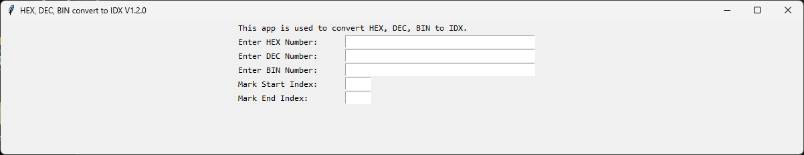
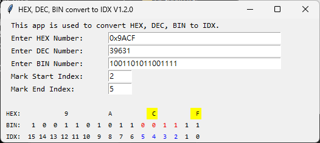
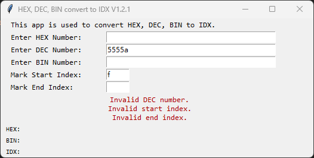

# HexDec2BinIndex

This app is used to convert HEX and DEC to BIN, and mark the corresponding bit index on BIN.
When referencing some IC datasheets, it can quickly and conveniently verify specific bits.

### Features:
1. The user can input hex, dec, or bin, and the app will automatically convert to the other number systems and index.
2. Functionality to mark specific ind.
3. Alerts for user input errors.
4. Automatically adjusts the window width, theoretically allowing for unlimited input numbers.

#### Start Window:

#### Usage demonstration:

#### When input error occurs:

### Version Information

#### 1.2.1
- Added code comments and fixed exception handling

#### 1.2.0
- Add BIN input function

#### 1.1.1
- When there is a mark error, the conversion can still work, but the mark will not be applied.
- Add some comments to the code.

#### 1.1.0
- Added DEC and optimized label display performance

#### 1.0.0
- Initial release
- python 3.9.13